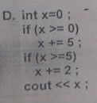
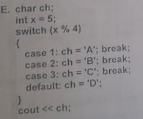
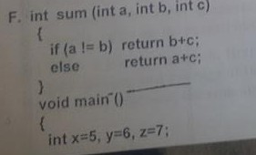

# 2016 Final
---
## ** 2 **

###  a

```
5
-10
```
###  b

```
11
```
###  c

```
-27
```
###  d

```
7
```
###  e

```
A
```
###  f
    
** سؤال مقطوش :\ **   
** هنعتبر البرنامج نادي الفانكشن وطلع الخرج ع الشاشة **

```
sum(x,y,z) = 13
الخرج
13
```
## **3**
### a

```cpp

int n;
do{
	cout << "Enter N:";
	cin >> n;
}while(n <= 30);

int i = 6;

while(i < n){
	cout << i << endl;
	i+=2;
}
```
### b

```cpp
	int sum = 0;

	int i = 200;

	do{
		if(i%7==0) sum+= i;
	}while(++i<=300);

	cout << "Sum is " << sum << endl;
```
### c

```cpp
	int n;

	do{
		cout << "Enter Number: ";
		cin >> n;
		if(n<0) cout << n << " is a negative number !\n";
	}while(n!=0);
```
### e

```cpp
const int arrLen = 5;
int arr[arrLen] = {5,10,15,20,25};

for(int i=arrLen-1 ; i>=0 ; i--)
  cout << arr[i] << endl;
```
### f

```cpp
const int STUDENTS_NUM = 25;
float x[STUDENTS_NUM];

for(int i = 0;i<STUDENTS_NUM;i++){
  cout << "Enter grades for student #" << i+1 << ":";
  cin >> x[i];
}
```

## **3**

### a

```cpp
return_type name(pram_type param_name){
  boady
}
```
### b

```cpp
#include <iostream>

using namespace std;

long Fact(int n){
	if(n<=1)return 1;
	else return n * Fact(n-1);
}

int main(){

	int num;
	cout << "Enter Number:";
	cin >> num;

	cout << num << "! = " << Fact(num) << endl;


}
```
### c

```cpp
#include <iostream>

using namespace std;

int Min(int arr[],int size){
	int min = arr[0];
	for(int i=1;i<size;i++){
		if(arr[i] < min) min = arr[i];
	}
	return min;
}

int main(){

	int n;
	cout << "Enter Number:";
	cin >> n;

	int arr[n];

	for(int i=0;i<n;i++){
		cout << "Enter Number " << i+1 << ":";
		cin >> arr[i];
	}

	cout << "The min is " << Min(arr,n) << endl;


}
```
## **4**

### a

```cpp
type name[length];
```
### b

```cpp
#include <iostream>

using namespace std;

int main(){

	const int ARR_SIZE = 30;
	int A[ARR_SIZE];

	int count = 0;

	for(int i=0;i<ARR_SIZE;i++){
		cout << "Enter #"<<i+1<<": ";
		cin >> A[i];
		if(A[i]%2!=0)count++;
	}

	cout << "Array :\n";
	for(int i=0;i<ARR_SIZE;i++)cout << A[i] << endl;
	cout << "\nOdd Count : " << count << endl;
}
```
### c

```cpp
#include <iostream>

using namespace std;

int main(){

	const int ARR_SIZE = 20;
	float X[ARR_SIZE];

	float sum = 0;

	for(int i=0;i<ARR_SIZE;i++){
		cout << "Enter #"<<i+1<<": ";
		cin >> X[i];
		sum+=X[i];
	}

	cout << "Array :\n";
	for(int i=0;i<ARR_SIZE;i++)cout << X[i] << endl;
	cout << "\nSum : " << sum << endl;
	cout << "Avg : " << sum/ARR_SIZE0 << endl;
}
```
